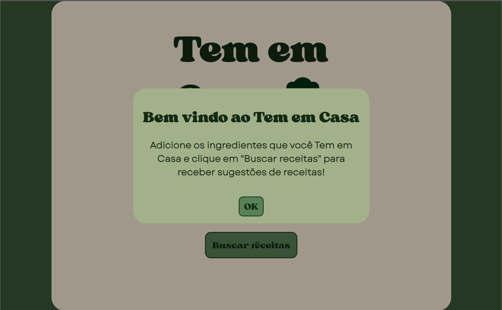
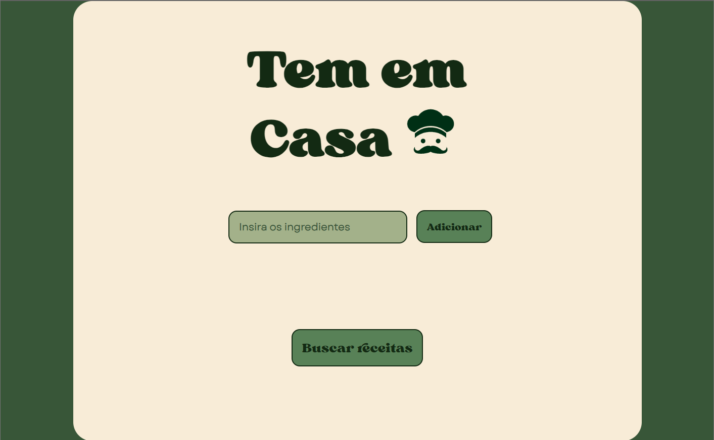
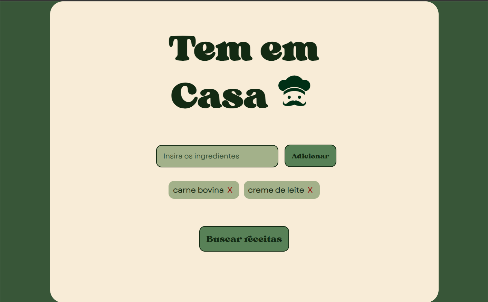
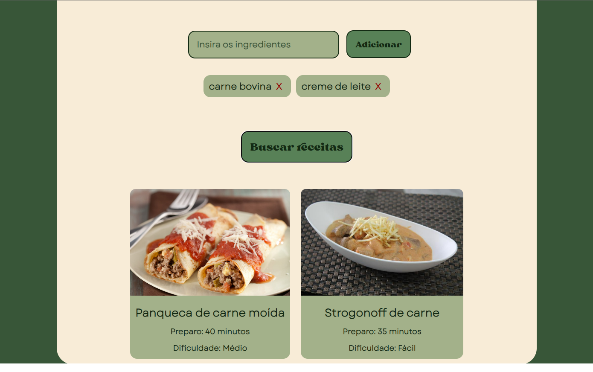

# Tem em Casa

## Conteúdos Aplicados

### HTML 

- Estrutura semântica de tags
- Formulários

### CSS

- Conceito e aplicação de BoxModel
- Conceito e aplicação de FlexBox
- Responsividade com Media Queries

### JS

- Funções
- Manipulação de array
- Manipulação de objetos
- Manipulação do DOM
- Requisição HTTP em servidor

## Descrição do Projeto

O projeto "Tem em Casa" é uma aplicação de busca de receitas que permite aos usuários encontrar e descobrir novas receitas com base nos ingredientes disponíveis em suas casas. Este repositório é referente ao front-end do projeto desenvolvido como parte da disciplina de Desenvolvimento de Software do segundo período do curso de Engenharia de Software da Universidade de Brasília (UnB).

A ideia principal do projeto é fornecer aos usuários uma solução conveniente e prática para aproveitar os ingredientes que já possuem em casa, evitando o desperdício de alimentos e inspirando-os a experimentar novas receitas. Com o "Tem em Casa", os usuários podem inserir uma lista de ingredientes e obter uma lista de receitas compatíveis, com tempo e dificuldade de execução.

## Funcionalidades Principais

- Busca de receitas com base nos ingredientes disponíveis
- Tempo de preparo
- Dificuldade de execução

## Demonstração

Clique [aqui](https://tememcasa.netlify.app/) para acessar o Tem em Casa!
Veja abaixo as capturas de tela da aplicação.

### Apresentação

### Página Inicial

### Seleção dos Ingredientes

### Receitas
 

## Autores

Este projeto foi desenvolvido por [Rafael Pereira](https://github.com/rafgpereira) e [João Pedro Silva](https://github.com/JoaoPedrosilvaSousa).
